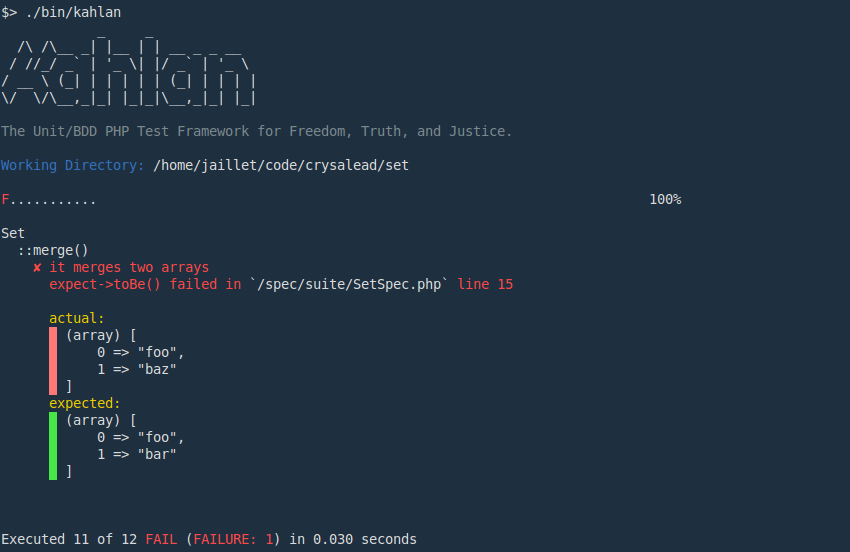
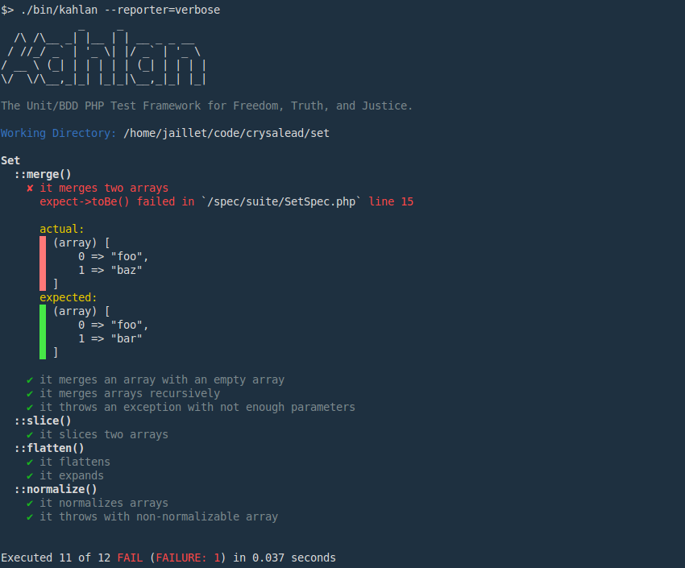
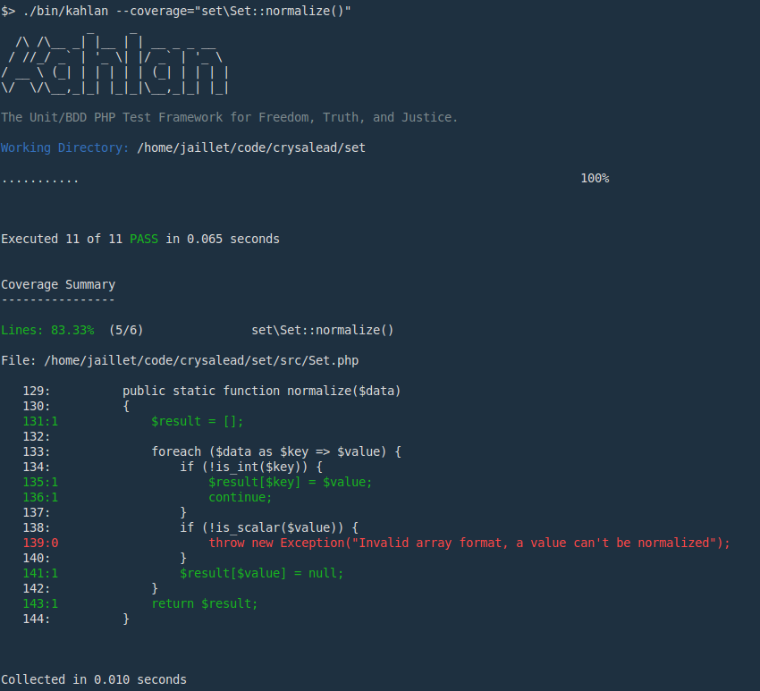

<hr/>

 [](https://travis-ci.org/kahlan/kahlan) [](http://hhvm.h4cc.de/package/kahlan/kahlan) [](https://packagist.org/packages/kahlan/kahlan)

[](https://packagist.org/packages/kahlan/kahlan)
[](https://packagist.org/packages/kahlan/kahlan)
[](https://codeclimate.com/github/kahlan/kahlan)
[](https://coveralls.io/r/kahlan/kahlan?branch=master)
[](https://scrutinizer-ci.com/g/kahlan/kahlan/?branch=master)

Kahlan is a full-featured Unit & BDD test framework a la RSpec/JSpec which uses a `describe-it` syntax and moves testing in PHP one step forward.

**Kahlan lets you stub or monkey patch your code directly like in Ruby or JavaScript without any required PECL-extentions.**

## Videos

* <a href="http://vimeo.com/116949820" target="_blank">Warren Seymour presentation at Unified Diff (2015)</a>
* <a href="https://www.grafikart.fr/tutoriels/php/tdd-kahlan-805" target="_blank">Grafikart presentation in French (2016, Kahlan 2.X)</a>

## IRC

**chat.freenode.net** (server)
**#kahlan** (channel)

## Documentation

See the whole [documentation here](https://kahlan.github.io/docs)

## Requirements

 * PHP 5.4+
 * Composer
 * [phpdbg](http://php.net/manual/en/debugger-about.php) or [Xdebug](http://xdebug.org/) (required for code coverage analysis only)

## Main Features

* RSpec/JSpec syntax
* Code Coverage metrics ([xdebug](http://xdebug.org) or [phpdbg](http://phpdbg.com/docs) required)
* Handy stubbing system ([mockery](https://github.com/padraic/mockery) or [prophecy](https://github.com/phpspec/prophecy) are no longer needed)
* Set stubs on your class methods directly (i.e allows dynamic mocking)
* Ability to Monkey Patch your code (i.e. allows replacement of core functions/classes on the fly)
* Check called methods on your classes/instances
* Built-in Reporters (Terminal or HTML reporting through [istanbul](https://gotwarlost.github.io/istanbul/) or [lcov](http://ltp.sourceforge.net/coverage/lcov.php))
* Built-in Exporters (Coveralls, Code Climate, Scrutinizer, Clover)
* Extensible, customizable workflow

## Syntax

```php
<?php

describe("Example", function() {

    it("makes an expectation", function() {

         expect(true)->toBe(true);

    });

    it("expects methods to be called", function() {

        $user = new User();
        expect($user)->toReceive('save')->with(['validates' => false]);
        $user->save(['validates' => false]);

    });

    it("stubs a function", function() {

        allow('time')->toBeCalled()->andReturn(123);
        $user = new User();
        expect($user->save())->toBe(true)
        expect($user->created)->toBe(123);

    });

    it("stubs a class", function() {

        allow('PDO')->toReceive('prepare', 'fetchAll')->andReturn([['name' => 'bob']]);
        $user = new User();
        expect($user->all())->toBe([['name' => 'bob']]);

    });

});

```

## Screenshots

### Example of default reporting:


### Example of verbose reporting:


### Example of code coverage on a specific scope:


## Installation

### via Composer

```bash
$ composer require --dev kahlan/kahlan
```

Note:
Kahlan uses the [Semantic Versioning](http://semver.org/) and maintains a `CHANGELOG` to help you easily understand what's happening.

### via Git clone

```
git clone git://github.com/kahlan/kahlan.git
cd kahlan
composer install
bin/kahlan              # to run specs or,
bin/kahlan --coverage=4 # to run specs with coverage info for namespaces, classes & methods (require xdebug)
```
